# Running Analytics Pipeline

Incremental analytics pipeline evaluating whether aerobic running efficiency
is improving over time, using Strava activities and historical hourly weather.
Pipeline-first: the deliverables are ingestion, warehouse models, metrics,
tests, and docs — the dashboard is a thin cap.

**Questions this answers** (that standard Strava/Apple Fitness views can't):

* Is pace at a comparable heart rate improving over time?
* How does running efficiency vary under different weather conditions?
* Is cardiac drift decreasing during longer runs?
* How is weekly volume changing alongside these efficiency measures?

**Full spec:** [docs/PROJECT_PLAN.md](docs/PROJECT_PLAN.md) (decisions D1–D21 are
locked; Revision v1.1 supersedes D9 and amends D15; Revision v1.2 corrects
the dbt layering — output-invariant).
**Status:** all six phases complete (Release 1.1 + presentation layer).

## Architecture

```text
Strava API ──────┐
                 ├──> Python ingestion (src/running_pipeline)
Open-Meteo API ──┘             │
                               v
                    PostgreSQL container
                    running_analytics_db (port 5433)
                               │
                               v
                    dbt transformations (dbt/)
                    staging → intermediate → core → marts
                               │
                               v
                    Streamlit app (app/)
                    (reads marts only, D19)
```

## Prerequisites

- Docker Desktop
- Python 3.13 (`brew install python@3.13`)
- A [Strava API application](https://www.strava.com/settings/api) (free)

## Setup

```bash
# 1. Virtual environment + dependencies
python3.13 -m venv .venv
source .venv/bin/activate
pip install -r requirements.txt

# 2. Configuration — fill in your Strava app credentials and a DB password
cp .env.example .env

# 3. Database (Postgres 17 on host port 5433; schemas created on first boot)
docker compose up -d

# 4. One-time Strava authorization (browser flow, ~30 seconds)
running-pipeline authorize

# 5. Verify authenticated access
running-pipeline athlete
```

## Environment variables

All configuration lives in `.env` (gitignored); the full annotated contract is
[`.env.example`](.env.example). Highlights:

| Variable | Purpose |
|---|---|
| `STRAVA_CLIENT_ID` / `STRAVA_CLIENT_SECRET` | From your Strava API app settings |
| `STRAVA_REFRESH_TOKEN` | Optional bootstrap only — after the first refresh, the rotated token in `.secrets/strava_tokens.json` is authoritative |
| `POSTGRES_*` | Database connection (decision D2: `running_analytics_db` / `running_user` / port 5433) |
| `SYNC_START_DATE`, `SYNC_OVERLAP_DAYS` | Ingestion window (decisions D5, D6 — used from Phase 1) |
| `WEATHER_REQUEST_BUDGET`, `WEATHER_BATCH_GAP_DAYS` | Optional weather-sync bounds (Phase 2). Open-Meteo needs **no API key** — there are no weather credentials |

## Token handling

Strava rotates the refresh token on every refresh. The pipeline persists the
newest access/refresh/expiry trio to `.secrets/strava_tokens.json`
(gitignored, `0600` permissions, atomic writes) immediately after every
refresh. Tokens are never logged. If the file is lost, re-run
`running-pipeline authorize`.

## Commands

```bash
make up               # start Postgres
make down             # stop Postgres
make bootstrap        # (re-)apply every sql/*.sql — idempotent
make athlete          # print the authenticated athlete profile
make sync-activities  # incremental Strava activity sync (14-day overlap)
make reconcile        # full reconciliation from SYNC_START_DATE
make backfill-coordinates # resolve run-start coordinates (payload, else polyline)
make sync-weather     # fetch hourly weather for outdoor runs not yet covered
make reconcile-weather # re-fetch weather even for already-cached hours
make sync-streams     # backfill activity streams for fetch-eligible runs
make app              # launch the Streamlit dashboard (three views)
make all              # full refresh: every sync, then dbt build
make dbt-build        # build all dbt models and run their tests
make dbt-test         # dbt tests only
make dbt-freshness    # source freshness (raw fetched_at ages)
make dbt-docs         # generate + serve dbt documentation locally
make dbt-dag          # regenerate the dbt DAG diagram embedded in this README
make test             # pytest (all external HTTP mocked; DB-integration
                      # tests skip visibly when Postgres is down)
make lint             # ruff check
make format           # ruff format
```

## Warehouse layout

Five schemas (decision D3): `raw_strava`, `raw_weather`, `staging`,
`intermediate`, `analytics`. Schemas and tables are created idempotently by
the [`sql/`](sql/) scripts on first container init (or `make bootstrap`).
Phase 1 owns `raw_strava.activities` — one row per activity, full API
payload in JSONB with sync-critical fields promoted to typed columns
(`activity_id` PK, `start_date_utc`, `activity_type`) — and
`raw_strava.sync_state`, which holds per-job sync watermarks. Phase 2 owns
`raw_weather.hourly` — one row per normalized location and UTC hour, typed
measurement columns plus the original per-hour payload in JSONB, unique on
`(location_key, weather_timestamp)`.

## Incremental sync strategy

`make sync-activities` loads every activity started on or after
`SYNC_START_DATE` (D5: 2024-01-01). Re-runs are idempotent: rows upsert by
`activity_id`, and rows whose payload is unchanged are skipped without
being rewritten, so inserted / updated / skipped counts are measured, not
inferred.

Each successful run records its own UTC start time as a watermark in
`raw_strava.sync_state`. The next incremental run re-fetches from
`watermark − SYNC_OVERLAP_DAYS` (D6: 14 days), so late uploads and recent
edits inside that window are captured automatically. One documented
limitation: the Strava list API filters on activity *start date*, so an
activity uploaded or edited more than 14 days after it occurred is only
caught by `make reconcile`, which re-fetches the whole historical window
on demand.

Transient API failures retry with bounded backoff (1s/2s/4s). When usage
approaches Strava's reported rate limits (≥90% of the 15-minute or daily
read limit), the sync stops cleanly: completed pages stay committed, the
watermark is not advanced, and the command exits with code 3 so the
interruption is visible — the next run simply re-covers the window. Failed
or interrupted runs never advance the watermark. Counts are logged on
every run; token values never are.

## Weather ingestion

`make sync-weather` attaches hourly weather (Open-Meteo historical archive,
decision D8) to each **outdoor run**: sport type `Run`/`TrailRun`, start
coordinates present, and Strava's `trainer` flag not set. Indoor and
virtual runs are excluded by design — they have no location, and outdoor
weather would be wrong for them — and are reported explicitly as
`runs_without_location`. Open-Meteo requires **no API key**; a per-sync
request budget (`WEATHER_REQUEST_BUDGET`) and 429 handling keep usage far
below its ~10k requests/day free tier, with the same stop-cleanly / exit
code 3 contract as the activity sync.

**Timezone handling:** everything is UTC end to end. Archive requests pass
`timezone=UTC`, returned hourly timestamps are stored as `timestamptz`,
and a run is matched to the observation at its start hour —
`date_trunc('hour', start_date_utc)` — never to a daily aggregate.

**The table is the cache.** There is no separate cache layer and no
watermark: each sync derives the location-hours eligible runs need,
subtracts what `raw_weather.hourly` already holds (unique on
`(location_key, weather_timestamp)`; coordinates are rounded to 2 decimal
places, a ~1.1 km cell, per decision D7), and batches the remainder into
one archive request per location and contiguous date range. Re-runs are
idempotent and repeated runs in the same cell hit the cache with zero
requests.

**Map-privacy fallback.** Strava's "hide entire map" setting strips
`start_latlng` from API payloads — even the owner's — so
`make backfill-coordinates` resolves each run's start coordinate with
explicit provenance in `raw_strava.activity_coordinates`: the payload's
`start_latlng` when present (free), else the first decoded point of the
detail endpoint's route polyline (one API call per run, resumable with
the same rate-limit contract as the other backfills), else an explicit
`unavailable` row. Weather eligibility and dbt staging prefer the
resolved coordinate over the payload.

## Warehouse models (dbt)

```mermaid
flowchart LR

    subgraph sources["Sources"]
        source_running_analytics_raw_strava_activities[("raw_strava.activities")]
        source_running_analytics_raw_strava_activity_coordinates[("raw_strava.activity_coordinates")]
        source_running_analytics_raw_strava_streams[("raw_strava.streams")]
        source_running_analytics_raw_strava_sync_state[("raw_strava.sync_state")]
        source_running_analytics_raw_weather_hourly[("raw_weather.hourly")]
    end

    subgraph seeds["Seeds"]
        seed_running_analytics_hr_bands(["hr_bands"])
        seed_running_analytics_temperature_bands(["temperature_bands"])
    end

    subgraph staging["Staging"]
        model_running_analytics_stg_strava__activities["stg_strava__activities"]
        model_running_analytics_stg_weather__hourly["stg_weather__hourly"]
    end

    subgraph intermediate["Intermediate"]
        model_running_analytics_int_band_window_samples["int_band_window_samples"]
        model_running_analytics_int_run_band_assessment["int_run_band_assessment"]
        model_running_analytics_int_run_efficiency["int_run_efficiency"]
        model_running_analytics_int_run_stream_samples["int_run_stream_samples"]
        model_running_analytics_int_run_stream_state["int_run_stream_state"]
        model_running_analytics_int_runs_with_weather["int_runs_with_weather"]
    end

    subgraph core["Core"]
        model_running_analytics_fct_band_candidates["fct_band_candidates"]
        model_running_analytics_fct_drift_candidates["fct_drift_candidates"]
        model_running_analytics_fct_run_band_segments["fct_run_band_segments"]
        model_running_analytics_fct_runs["fct_runs"]
    end

    subgraph marts["Marts"]
        model_running_analytics_mart_band_trend["mart_band_trend"]
        model_running_analytics_mart_band_weekly["mart_band_weekly"]
        model_running_analytics_mart_drift_trend["mart_drift_trend"]
        model_running_analytics_mart_efficiency_by_temp_band["mart_efficiency_by_temp_band"]
        model_running_analytics_mart_efficiency_trend["mart_efficiency_trend"]
        model_running_analytics_mart_run_drift["mart_run_drift"]
        model_running_analytics_mart_run_quality["mart_run_quality"]
        model_running_analytics_mart_weekly_training["mart_weekly_training"]
    end

    model_running_analytics_fct_band_candidates --> model_running_analytics_mart_run_quality
    model_running_analytics_fct_drift_candidates --> model_running_analytics_mart_run_drift
    model_running_analytics_fct_drift_candidates --> model_running_analytics_mart_run_quality
    model_running_analytics_fct_run_band_segments --> model_running_analytics_mart_band_trend
    model_running_analytics_fct_run_band_segments --> model_running_analytics_mart_band_weekly
    model_running_analytics_fct_runs --> model_running_analytics_mart_band_weekly
    model_running_analytics_fct_runs --> model_running_analytics_mart_efficiency_by_temp_band
    model_running_analytics_fct_runs --> model_running_analytics_mart_efficiency_trend
    model_running_analytics_fct_runs --> model_running_analytics_mart_run_drift
    model_running_analytics_fct_runs --> model_running_analytics_mart_run_quality
    model_running_analytics_fct_runs --> model_running_analytics_mart_weekly_training
    model_running_analytics_int_band_window_samples --> model_running_analytics_fct_run_band_segments
    model_running_analytics_int_band_window_samples --> model_running_analytics_int_run_band_assessment
    model_running_analytics_int_run_band_assessment --> model_running_analytics_fct_band_candidates
    model_running_analytics_int_run_band_assessment --> model_running_analytics_fct_run_band_segments
    model_running_analytics_int_run_efficiency --> model_running_analytics_fct_drift_candidates
    model_running_analytics_int_run_efficiency --> model_running_analytics_fct_runs
    model_running_analytics_int_run_efficiency --> model_running_analytics_int_run_band_assessment
    model_running_analytics_int_run_stream_samples --> model_running_analytics_fct_drift_candidates
    model_running_analytics_int_run_stream_samples --> model_running_analytics_int_band_window_samples
    model_running_analytics_int_run_stream_samples --> model_running_analytics_int_run_band_assessment
    model_running_analytics_int_run_stream_state --> model_running_analytics_fct_drift_candidates
    model_running_analytics_int_run_stream_state --> model_running_analytics_int_run_band_assessment
    model_running_analytics_int_runs_with_weather --> model_running_analytics_int_run_efficiency
    model_running_analytics_mart_band_weekly --> model_running_analytics_mart_band_trend
    model_running_analytics_mart_run_drift --> model_running_analytics_mart_drift_trend
    model_running_analytics_mart_weekly_training --> model_running_analytics_mart_efficiency_trend
    model_running_analytics_stg_strava__activities --> model_running_analytics_int_runs_with_weather
    model_running_analytics_stg_weather__hourly --> model_running_analytics_int_runs_with_weather
    seed_running_analytics_hr_bands --> model_running_analytics_int_band_window_samples
    seed_running_analytics_hr_bands --> model_running_analytics_mart_band_weekly
    seed_running_analytics_temperature_bands --> model_running_analytics_mart_efficiency_by_temp_band
    seed_running_analytics_temperature_bands --> model_running_analytics_mart_efficiency_trend
    seed_running_analytics_temperature_bands --> model_running_analytics_mart_run_quality
    source_running_analytics_raw_strava_activities --> model_running_analytics_stg_strava__activities
    source_running_analytics_raw_strava_activity_coordinates --> model_running_analytics_stg_strava__activities
    source_running_analytics_raw_strava_streams --> model_running_analytics_int_run_stream_samples
    source_running_analytics_raw_strava_streams --> model_running_analytics_int_run_stream_state
    source_running_analytics_raw_weather_hourly --> model_running_analytics_stg_weather__hourly
```

<!-- dbt-dag:start -->

<!-- dbt-dag:end -->

The dbt project lives in `dbt/` (decision D4) and is driven entirely
through the Make targets above; `dbt/profiles.yml` is auto-copied from
the committed example on first run and reads connection values from the
same `.env` contract as the Python pipeline — no separate credentials.
One node renders without edges by design: `raw_strava.sync_state` holds
operational sync watermarks, declared in `sources.yml` for source
inventory but deliberately not modeled downstream.

| Layer | Model | Schema | Grain |
|---|---|---|---|
| Staging | `stg_strava__activities` | `staging` | one row per activity, any sport type |
| Staging | `stg_weather__hourly` | `staging` | one row per D7 cell + UTC hour, metric & imperial units |
| Intermediate | `int_band_window_samples` | `intermediate` | one row per activity + pooled band-window sample: HR band + capped dwell contribution (D22) |
| Intermediate | `int_run_band_assessment` | `intermediate` | one row per band candidate — window stats + the D22 exclusion ladder, encoded once |
| Intermediate | `int_run_efficiency` | `intermediate` | one row per running activity — derived measures, weather context, efficiency and validity verdict; the sole parent of `fct_runs`, and also feeds `fct_drift_candidates` |
| Intermediate | `int_run_stream_samples` | `intermediate` | one row per activity + aligned stream sample |
| Intermediate | `int_run_stream_state` | `intermediate` | one row per stream-fetch attempt: status + required-array presence |
| Intermediate | `int_runs_with_weather` | `intermediate` | one row per running activity + nearest qualifying observation |
| Core | `fct_band_candidates` | `analytics` | one row per band candidate — projection of the assessment: window stats + exclusion verdict (D22) |
| Core | `fct_drift_candidates` | `analytics` | one row per drift candidate + halves and exclusion verdict |
| Core | `fct_run_band_segments` | `analytics` | one row per analyzed run × HR band with ≥ 5 min dwell: dwell, sample count, median velocity/pace |
| Core | `fct_runs` | `analytics` | one row per running activity — the mart-facing contract: measures, weather, validity + efficiency |
| Mart | `mart_band_trend` | `analytics` | one row per week × HR band + 28-day rolling median pace (the mart the dashboard reads) |
| Mart | `mart_band_weekly` | `analytics` | one row per week × HR band — median of per-run band medians (not app-facing; travels inside the trend mart) |
| Mart | `mart_drift_trend` | `analytics` | one row per week of drift runs + rolling median |
| Mart | `mart_efficiency_by_temp_band` | `analytics` | one row per D14 temp band (+ explicit weather-unavailable row) |
| Mart | `mart_efficiency_trend` | `analytics` | one row per week + 28-day rolling median |
| Mart | `mart_run_drift` | `analytics` | one row per analyzed drift run |
| Mart | `mart_run_quality` | `analytics` | one row per running activity + quality verdicts (validity, band, drift, HR band) |
| Mart | `mart_weekly_training` | `analytics` | one row per training week |
| Seed | `hr_bands` | `analytics` | the D22 10-bpm HR bands (open-ended edges), defined once, joined by range everywhere |
| Seed | `temperature_bands` | `analytics` | the D14 bands, defined once, joined by range everywhere |

Conventions worth knowing: the running-activity filter
(Run/TrailRun/VirtualRun) is applied after staging, never in it; weather
matches the *nearest* observation that actually carries measurements
(explicit "archive had no data" rows never match) and only counts as
matched within 60 minutes of the run's start; training weeks are local
wall-clock (`week_start_date` = Monday of the local week); metric
thresholds (the D9 run-validity rules as revised by v1.1, the 45-minute
long-run definition, the D22 band window and dwell rules) are dbt vars,
never inline SQL. Layer dependencies are directional and
machine-checked: marts read core, seeds, and other marts (today a
single mart-to-mart hop feeds each trend); intermediate never reads
core, and since v1.4 may read seeds — one deliberate matrix line, added
for the `hr_bands` sample-grain join and proven against the guard
before it changed. `source()` is a staging-only privilege with one
documented exception — `raw_strava.streams`, readable from intermediate
models only, because stream payloads' only useful transformation is a
grain change. All of it is enforced by a manifest-based test
(`tests/test_dbt_layering.py`), not convention. Every measurement column
carries an explicit unit suffix, and missing HR/weather stays NULL
through every layer.

**Missing weather is explicit, never zero.** Hours the archive genuinely
has no data for are stored as rows with NULL measurements and the original
payload preserved; later incremental syncs re-request those hours until
data appears. That is the rare case, not the normal one: requests pass no
`models` parameter, so the archive defaults to `best_match`, which serves
recent dates immediately with preliminary ECMWF IFS fill-in values that
the same request can later silently replace once ERA5 covers the date. A
cache-completeness check must know whether the source's answer was final;
ours treats any non-NULL value as final, so preliminary values are frozen
until a full re-fetch (`make reconcile-weather`), whose `IS DISTINCT FROM`
upsert absorbs any revisions. A failed
request for one location never fails the sync — it is logged, counted in
`failed_batches`, and retried next run. Exact coordinates are never logged;
only 2-decimal cell keys appear in logs and stored keys.

## Metric definitions

**Aerobic efficiency (D10)** — the project's primary metric:

```text
aerobic_efficiency_m_per_heartbeat = speed_m_per_min / average_hr_bpm
```

Approximate meters traveled per heartbeat. Higher = faster at the same
heart rate, or a lower heart rate at the same speed. **This is an
observational signal, not proof of physiological improvement.** The
approved framing is *"pace-at-heart-rate efficiency has increased across
runs with valid heart-rate data"* — never *"the metric proves aerobic
fitness improved."* Weather, terrain, sleep, and measurement noise all
move it, and **intensity mix is not controlled for**: the metric already
normalizes by HR, so hard efforts and races feed the same aggregates,
with average HR displayed alongside for context.

**Run validity (D9, revised by v1.1)** — a run feeds every efficiency
aggregate when all of the following hold (each threshold is a dbt var,
editable in `dbt/dbt_project.yml` without touching model SQL). There is
no intensity ceiling and no race/workout exclusion:

| Rule | Default |
|---|---|
| Heart-rate data present | required |
| Average HR within instrument-sanity band | 90–200 bpm |
| Pace within sanity bounds | 4:00–20:00 min/mi |
| Moving time | ≥ 15 min |

Invalid runs are never silently dropped: `int_run_efficiency` gives
every excluded run a human-readable `exclusion_reason` (the first failing
rule in a documented priority order), carried through `fct_runs` and
`mart_run_quality`.

**Weekly statistics (D11, D12)** — the weekly summary statistic is the
**median** efficiency across valid runs (mean shown as secondary);
a week is trend-worthy only with ≥ 2 valid runs (`is_sufficient`).
**Trend (D13)** — a 28-day rolling median over run-level efficiency
smooths single-week noise. **Temperature bands (D14)** — < 50 °F,
50–70 °F, > 70 °F, defined once in the `temperature_bands` seed and
joined by range; valid runs without matched weather appear in an
explicit *weather unavailable* row rather than vanishing from the
comparison.

**Pace at heart-rate band (D22, Revision v1.4)** — the sample-grain
counterpart to efficiency: pool each run's valid, moving stream samples
after trimming the first 5 minutes (warm-up HR is still climbing —
untrimmed samples pair a too-low HR with full pace and flatter the low
bands) and the final 2 minutes; assign each sample a 10-bpm HR band
(`hr_bands` seed, joined by range like D14); a run contributes to a
band only with ≥ 5 minutes of dwell there, so transitions passing
through a band never deposit junk medians. Per run per band the metric
is the **median velocity** (pace derived from it for display); the
weekly statistic is the **median across contributing runs of those
run-level medians** (D11's median-of-runs philosophy), with the D12
2-run sufficiency flag at week × band grain and a 28-day rolling median
per band (D13). **Sign of interest: rising pace — falling min/mi — at
the same HR band is the observational signal of an improving aerobic
base**, with the same never-causal framing as efficiency and drift.
Dwell is capped per sample at the drift coverage gap (3 s), and runs
failing any check carry a deterministic `band_exclusion_reason` through
`fct_band_candidates` into `mart_run_quality`.

## Stream ingestion and cardiac drift

`make sync-streams` backfills time-series streams (time, heart rate,
smoothed velocity, moving flag, grade) for fetch-eligible runs per D15
(revised v1.4): running activity, heart rate present, moving time ≥
`STREAM_FETCH_MIN_MOVING_MINUTES` (default 20), within the historical
window. Fetching is a **data-availability decision**, split in v1.4
from the analysis gates — drift candidacy and `long_run_eligible` keep
their unchanged 45-minute threshold in dbt, and drift candidates remain
a strict subset of band candidates by construction. The backfill is
**resumable by construction**: each
activity's outcome commits as its own row in `raw_strava.streams` with
an explicit status — `success` and `unavailable` (Strava has no streams
for that activity; that never changes) are terminal, `failed` is retried
automatically next run, and an absent row means not yet attempted. At
most `STREAM_MAX_ACTIVITIES_PER_RUN` (default 50) activities per
invocation; rate limits stop the run cleanly between fetches with the
same exit-code-3 contract as the other syncs.

**Cardiac drift (decoupling)** — per D16, each analyzed run drops
non-moving samples, trims the first 10 minutes (warm-up) and final
5 minutes (cool-down), requires ≥ 30 minutes remaining, splits the
window into two equal-duration halves, and computes efficiency per half:

```text
decoupling_pct = (first_half_efficiency − second_half_efficiency)
                 / first_half_efficiency × 100
```

**Sign convention (D17): positive = efficiency declined in the second
half; near zero = stable; negative = the second half improved.** A
rising decoupling trend over comparable long runs is the observational
signal of interest — never proof of a fitness change on its own.

Coverage and pause thresholds (the two checks D16 leaves unquantified)
are dbt vars: average sample spacing in the window ≤ 3 s, non-moving
share ≤ 25 %. Every drift candidate that can't be analyzed carries a
deterministic exclusion reason in `fct_drift_candidates`; drift trend
weeks below the D12 run count are flagged `is_sufficient = false` and
excluded from trend lines, but stay visible in every table — never
deleted.

## Dashboard

`make app` serves exactly three Streamlit views (decision D19):
**Aerobic Efficiency** (weekly + 28-day rolling trend, temperature-band
comparison, and the D22 pace-at-HR-band section — the same analytical
question with intensity controlled by construction, so it lives inside
this view rather than amending the three-view cap), **Weekly Training**
(mileage, moving time, run counts), and **Cardiac Drift** (run-level
decoupling with the rolling trend). The app is deliberately thin: it
reads **only the approved mart tables** — enforced by an explicit
table-level allow-list in the app code plus a test that pins the list's
exact contents and refuses any other relation, core facts included
(core and marts share the `analytics` schema, so a schema check alone
could not tell them apart) — and contains no business logic; every
metric, threshold, and flag is computed and tested in dbt.
Sample counts appear beside every statistic; weeks below the D12 run
count are flagged `is_sufficient = false` and excluded from trend lines,
but stay visible in every table; and each empty view explains exactly
what data would populate it.

## Data-quality principles

1. **Missing never means zero.** Absent HR, weather, or streams stays
   NULL (or an explicit status row) through every layer, down to the
   dashboard's empty states.
2. **Raw data stays recoverable.** Full API payloads live in JSONB next
   to the typed columns that ingestion itself needs; remodeling is a
   re-transform, never a re-download.
3. **Exclusion is explained, never silent.** Every ineligible run
   carries a human-readable reason; every aggregate carries its sample
   count.
4. **Idempotency everywhere.** Re-running any sync or build converges;
   nothing duplicates and nothing is lost to interruption.

## Known limitations

* Activities uploaded or edited **more than 14 days after they
  occurred** are only caught by `make reconcile`, not incremental sync.
  (The July 2026 heart-rate re-import was ingested exactly this way:
  old-dated re-uploads are invisible to the incremental window.)
* Open-Meteo's archive, queried without a `models` parameter, defaults to
  `best_match` — a per-hour stitch of ERA5 (0.25°, ~5-day delay),
  ERA5-Land (0.1°), and low-latency ECMWF IFS analysis (9 km). Recent
  runs therefore get **real preliminary values immediately**, not NULLs,
  and the response never indicates which dataset served which hour
  (`fetched_at` relative to the observation date is the only heuristic
  proxy). Because the cache-completeness check treats any non-NULL value
  as final, preliminary values are frozen until `make reconcile-weather`
  re-fetches them (its `IS DISTINCT FROM` upsert absorbs revisions).
  Under a daily `make all`, nearly every new run's weather is fetched
  inside the IFS window and frozen, while historical backfill is final
  reanalysis — two quality regimes in one dataset. All-NULL rows still
  occur, and still self-heal on later syncs, only when the archive
  genuinely has no data for an hour — now the rare case.
* The **dashboard screenshots** in `images/` are still pending capture
  now that the marts are populated. (dbt lineage is rendered directly
  in this README via `make dbt-dag`.)
